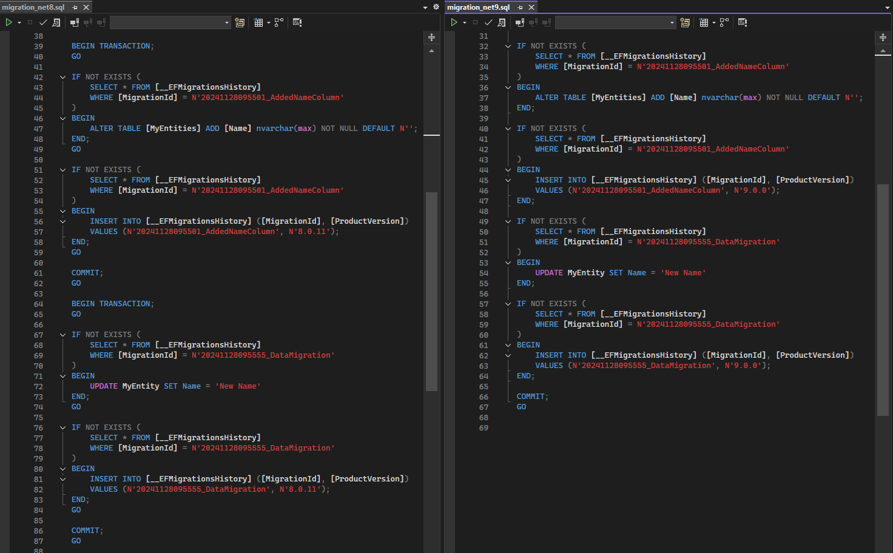

# EfCoreMinimalReproducibleExample
Minimal reproducible example
 
## Steps to Reproduce

### Use EntityFrameworkCore 9.0.0

1. Update references to EntityFrameworkCore 9.0.0
2. `dotnet ef migrations script --idempotent --project EfCoreMinimalReproducibleExample --output result/migration_net9.sql`
3. see generated output `migration_net9.sql`

### Use EntityFrameworkCore 8.0.11

1. Update references to EntityFrameworkCore 8.0.11
2. `dotnet ef migrations script --idempotent --project EfCoreMinimalReproducibleExample --output result/migration_net8.sql`
3. see generated output `migration_net8.sql`

## Observation

With the `8.0.11` package separate transactions are created. `9.0.0` handles this differently:

