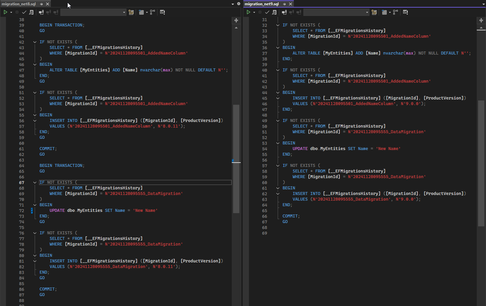

# EfCoreMinimalReproducibleExample
Minimal reproducible example
 
## Steps to Reproduce

### EntityFrameworkCore 9.0.0

`dotnet ef migrations script --idempotent --project EfCoreMinimalReproducibleExample --output result/migration_net9.sql`

see generated output `migration_net9.sql`

### EntityFrameworkCore 8.0.11

`dotnet ef migrations script --idempotent --project EfCoreMinimalReproducibleExample --output result/migration_net8.sql`

see generated output `migration_net8.sql`

## Observation

